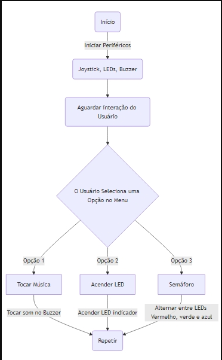

# Assistente Interativo

## Descrição

O **Assistente Interativo** é um projeto baseado na placa BitDogLab que combina funcionalidades de som e iluminação, com uma interface interativa. O dispositivo permite ao usuário selecionar diferentes opções usando um joystick, ativando funções como a reprodução de som, controle de LEDs e efeitos dinâmicos com um LED RGB.

## Funcionalidades

- **Tocar música**: Quando o usuário seleciona a primeira opção do menu, um som é reproduzido usando o buzzer.
- **Acender LED**: A segunda opção ativa um LED para indicar a seleção.
- **Efeito Semáforo**: A terceira opção ativa um efeito visual utilizando um LED RGB, simulando um semáforo, alternando entre as cores vermelha, verde e azul.

## Componentes Utilizados

- Placa BitDogLab
- Buzzer
- LED RGB (para simular um semáforo)
- Joystick para navegação
- Display OLED SSD1306

## Diagrama de Conexão

| Componente     | Pino na BitDogLab      |
| -------------- | ---------------------- |
| Joystick X     | 20 (ADC)               |
| Joystick Y     | 27 (ADC)               |
| Botão Joystick | 22 (GPIO)              |
| Buzzer         | 21 (PWM)               |
| LED Vermelho   | 11 (GPIO)              |
| LED Verde      | 13 (GPIO)              |
| LED Azul       | 12 (GPIO)              |
| Display OLED   | SDA: 14, SCL: 15 (I2C) |

## Fluxograma

O fluxo do projeto pode ser visualizado no fluxograma abaixo:



## Vídeo do Projeto

Para uma demonstração visual do funcionamento do **Assistente Interativo**, você pode assistir ao vídeo no YouTube:

[Assistente Interativo - Demonstração](https://youtu.be/bbwspjmm2bQ?si=sJvpYlOrUuYIUcvX)

## Código Explicado

O código do **Assistente Interativo** é estruturado para funcionar com a interface do usuário através de um joystick, controle de LEDs e buzzer. Abaixo está uma explicação detalhada sobre o funcionamento de cada parte do código:

### 1. **Bibliotecas e Definições**

No início do código, são importadas as bibliotecas necessárias para controlar os periféricos:

```c
#include "pico/stdlib.h"
#include "hardware/pwm.h"
#include "hardware/adc.h"
#include "ssd1306.h"
```

- `pico/stdlib.h`: Biblioteca padrão para trabalhar com a placa Raspberry Pi Pico.
- `hardware/pwm.h`: Biblioteca para controle de PWM (Pulse Width Modulation), usada para controle de brilho do LED RGB.
- `hardware/adc.h`: Biblioteca para leitura de entradas analógicas, usada para ler os valores do joystick.
- `ssd1306.h`: Biblioteca para controle do display OLED SSD1306.

### 2. **Inicialização dos Periféricos**

A função `init_peripherals()` é responsável por configurar os periféricos necessários para o projeto:

```c
void init_peripherals() {
    // Configurar o ADC para leitura do joystick
    adc_init();
    adc_gpio_init(20);  // Joystick X
    adc_gpio_init(27);  // Joystick Y

    // Configuração dos LEDs (Vermelho, Verde e Azul)
    gpio_init(11); // LED Vermelho
    gpio_init(13); // LED Verde
    gpio_init(12); // LED Azul

    // Configuração do buzzer
    gpio_init(21);  // Buzzer
    gpio_set_dir(21, GPIO_OUT); // Definir buzzer como saída

    // Configuração do display OLED
    i2c_init(i2c_default, 400 * 1000); // Inicializar I2C a 400 kHz
    ssd1306_init();
}
```

Nessa função, os pinos do joystick, LEDs, buzzer e display OLED são configurados adequadamente. A leitura do joystick é feita por meio de um conversor analógico para digital (ADC), e os LEDs são configurados para saída digital.

### 3. **Leitura do Joystick**

Para controlar o menu e navegar entre as opções, o valor do joystick é lido de forma analógica:

```c
int read_joystick_x() {
    adc_select_input(0); // Selecionar o canal para o eixo X
    return adc_read();
}

int read_joystick_y() {
    adc_select_input(1); // Selecionar o canal para o eixo Y
    return adc_read();
}
```

Essas funções leem os valores analógicos do joystick e retornam um valor entre 0 e 4095. O valor pode ser usado para determinar a direção do movimento do joystick.

### 4. **Exibição do Menu**

O menu é exibido no display OLED, onde o usuário pode escolher uma das opções. Um exemplo de como o menu pode ser exibido:

```c
void display_menu(int option) {
    ssd1306_clear_screen();
    ssd1306_set_cursor(0, 0);
    if (option == 0) {
        ssd1306_write_string("1. Tocar Musica", 1);
        ssd1306_write_string("> 2. Acender LED", 1);
        ssd1306_write_string("3. Semaforo", 1);
    } else if (option == 1) {
        ssd1306_write_string("1. Tocar Musica", 1);
        ssd1306_write_string("2. Acender LED", 1);
        ssd1306_write_string("> 3. Semaforo", 1);
    }
    ssd1306_update();
}
```

Essa função altera o texto exibido com base na opção escolhida. A seta `>` indica a opção selecionada.

### 5. **Ações do Menu**

Dependendo da opção selecionada, diferentes ações são executadas:

#### Opção 1: Tocar Música (Buzzer)

Quando o usuário escolhe a opção para tocar música, o buzzer emite um som:

```c
void play_music() {
    gpio_put(21, 1); // Ativar buzzer
    sleep_ms(500);
    gpio_put(21, 0); // Desativar buzzer
}
```

#### Opção 2: Acender LED

A segunda opção acende um LED de cor específica:

```c
void turn_on_led() {
    gpio_put(11, 1); // Acende o LED Vermelho
    sleep_ms(1000);
    gpio_put(11, 0); // Apaga o LED Vermelho
}
```

#### Opção 3: Semáforo (LED RGB)

A terceira opção altera entre o LED vermelho e verde, simulando um semáforo:

```c
void semaphore() {
    gpio_put(11, 1); // Acende o LED Vermelho
    gpio_put(13, 0); // Apaga o LED Verde
    sleep_ms(1000);
    gpio_put(11, 0); // Apaga o LED Vermelho
    gpio_put(13, 1); // Acende o LED Verde
    sleep_ms(1000);
}
```

### 6. **Loop Principal**

No loop principal do programa, o código espera a interação do usuário:

```c
int main() {
    init_peripherals();

    int option = 0;

    while (1) {
        display_menu(option);
        
        // Ler joystick e ajustar a opção do menu
        if (read_joystick_y() > 3000) {
            option = (option + 1) % 3; // Avançar para a próxima opção
        }

        // Ação com base na opção escolhida
        if (option == 0) {
            play_music();
        } else if (option == 1) {
            turn_on_led();
        } else if (option == 2) {
            semaphore();
        }

        sleep_ms(100);
    }
}
```

Esse loop permite que o usuário navegue entre as opções e execute a ação correspondente à seleção.

---

## Instalação e Uso

1. **Configurar o ambiente de desenvolvimento**:

   - Instale o SDK do Raspberry Pi Pico.
   - Configure a toolchain para compilar códigos em C/C++.
   - Certifique-se de ter a biblioteca para o display SSD1306.

2. **Compilar e carregar o código**:

   - Clone o repositório do projeto.
   - Compile usando `cmake` e `make`.
   - Carregue o arquivo `.uf2` na placa BitDogLab.

3. **Navegação no menu**:

   - Use o joystick para mover entre as opções.
   - Pressione o botão para selecionar uma opção.
   - O efeito correspondente será ativado.

## Licença

Este projeto é de código aberto sob a licença MIT.

## Autor

Desenvolvido por Vanessa Pereira Cunha.

## Referências

Este projeto foi desenvolvido utilizando a plataforma BitDogLab, cujas bibliotecas podem ser encontradas no repositório oficial [BitDogLab-C](https://github.com/BitDogLab/BitDogLab-C).

